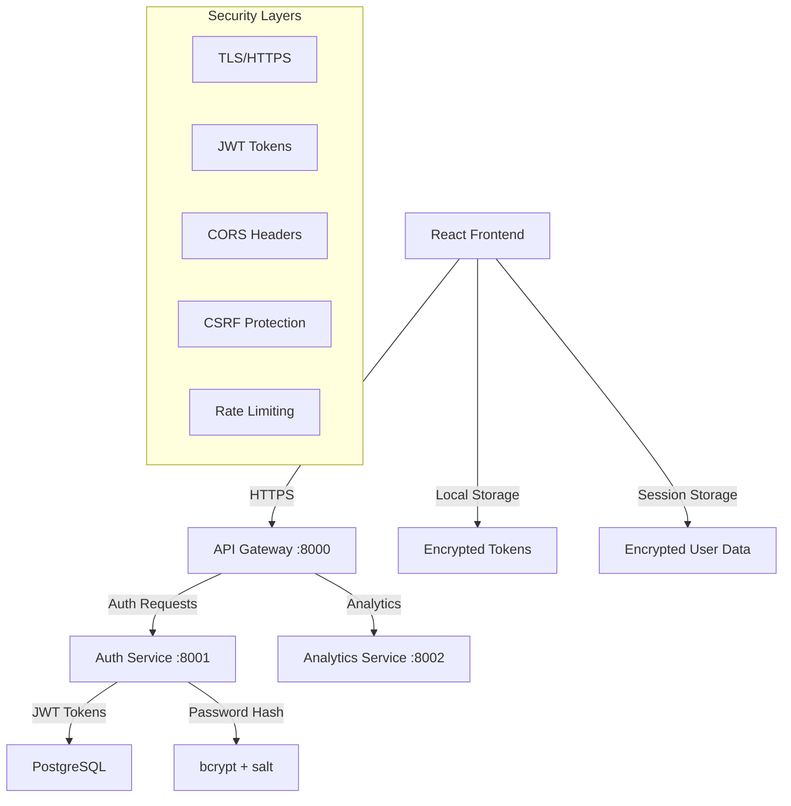

# 🔐 OpenBioCure Authentication & Security Guide

## 🎯 **Your Million Fucking Questions Answered**

This guide covers **everything** about connecting your React frontend to the FastAPI backend with **OAuth, encryption, and secure token management**.

---

## 🏗️ **Architecture Overview**



---

## 🚀 **Complete Authentication Flow**

### **1. User Login Process**

```typescript
// Frontend: User enters email + password
const credentials = {
  email: "user@example.com",
  password: "securePassword123!"
}

// Step 1: Frontend sends to backend
POST http://localhost:8000/auth/login
{
  "email": "user@example.com",
  "password": "securePassword123!",
  "tenant_id": "optional_tenant"
}

// Step 2: Backend validates & returns tokens
{
  "access_token": "eyJ0eXAiOiJKV1QiLCJhbGci...",
  "refresh_token": "eyJ0eXAiOiJKV1QiLCJhbGci...",
  "token_type": "bearer",
  "expires_in": 3600,
  "user": {
    "id": "user_123",
    "email": "user@example.com",
    "name": "John Doe",
    "tenant": "acme_corp",
    "features": ["full_access"]
  },
  "session_key": "encryption_key_for_client"
}

// Step 3: Frontend stores securely
localStorage.setItem('openbiocure_access_token', access_token)
localStorage.setItem('openbiocure_refresh_token', refresh_token)
localStorage.setItem('openbiocure_user', JSON.stringify(user))
```

### **2. Making Authenticated API Calls**

```typescript
// Every API request includes the JWT token
const response = await fetch('/api/research/projects', {
  headers: {
    'Authorization': `Bearer ${accessToken}`,
    'Content-Type': 'application/json'
  }
})

// Backend validates the JWT and extracts user context
const userInfo = jwt.verify(token, secret)
// userInfo contains: user_id, tenant_id, role, permissions
```

### **3. Token Refresh Flow**

```typescript
// When access token expires (detected by 401 response)
if (response.status === 401) {
  // Automatically refresh token
  const newTokens = await refreshAccessToken()
  
  if (newTokens) {
    // Retry original request with new token
    return fetch(originalUrl, {
      ...originalOptions,
      headers: {
        ...originalOptions.headers,
        'Authorization': `Bearer ${newTokens.access_token}`
      }
    })
  } else {
    // Refresh failed - redirect to login
    logout()
    window.location.href = '/login'
  }
}
```

---

## 🔒 **Security Implementation**

### **Password Security**

```python
# Backend: Password hashing with bcrypt
from passlib.context import CryptContext

pwd_context = CryptContext(schemes=["bcrypt"], deprecated="auto")

def hash_password(password: str) -> str:
    return pwd_context.hash(password)

def verify_password(plain_password: str, hashed_password: str) -> bool:
    return pwd_context.verify(plain_password, hashed_password)
```

```typescript
// Frontend: Password validation before sending
import { validatePasswordStrength } from './utils/encryption'

const validation = validatePasswordStrength(password)
if (!validation.isValid) {
  throw new Error(`Weak password: ${validation.feedback.join(', ')}`)
}
```

### **Data Encryption**

```typescript
// Frontend: Encrypt sensitive data before transmission
import { encryptFormData } from './utils/encryption'

const sensitiveData = {
  creditCard: "4111-1111-1111-1111",
  ssn: "123-45-6789"
}

const encrypted = encryptFormData(sensitiveData)
// Send encrypted data to backend
```

### **JWT Token Structure**

```json
{
  "header": {
    "alg": "HS256",
    "typ": "JWT"
  },
  "payload": {
    "sub": "user_123",
    "email": "user@example.com",
    "tenant_id": "acme_corp",
    "tenant_slug": "acme-corp",
    "role": "admin",
    "permissions": ["read", "write", "delete"],
    "iat": 1642680000,
    "exp": 1642683600,
    "correlation_id": "req_456"
  }
}
```

---

## 🛡️ **OAuth 2.0 Implementation**

### **Authorization Code Flow**

```typescript
// 1. Redirect to OAuth provider
const oauthUrl = `https://oauth.provider.com/authorize?
  response_type=code&
  client_id=${CLIENT_ID}&
  redirect_uri=${REDIRECT_URI}&
  scope=openid email profile&
  state=${generateSecureRandom()}`

window.location.href = oauthUrl

// 2. Handle OAuth callback
const urlParams = new URLSearchParams(window.location.search)
const authCode = urlParams.get('code')
const state = urlParams.get('state')

// 3. Exchange code for tokens
const tokenResponse = await fetch('/auth/oauth/token', {
  method: 'POST',
  body: JSON.stringify({
    code: authCode,
    state: state,
    client_id: CLIENT_ID,
    client_secret: CLIENT_SECRET
  })
})
```

### **Social Login Integration**

```typescript
// Google OAuth
const googleLogin = () => {
  const params = new URLSearchParams({
    client_id: process.env.REACT_APP_GOOGLE_CLIENT_ID,
    redirect_uri: `${window.location.origin}/auth/google/callback`,
    response_type: 'code',
    scope: 'openid email profile',
    access_type: 'offline',
    prompt: 'consent'
  })
  
  window.location.href = `https://accounts.google.com/o/oauth2/v2/auth?${params}`
}

// GitHub OAuth
const githubLogin = () => {
  const params = new URLSearchParams({
    client_id: process.env.REACT_APP_GITHUB_CLIENT_ID,
    redirect_uri: `${window.location.origin}/auth/github/callback`,
    scope: 'user:email',
    state: generateSecureRandom()
  })
  
  window.location.href = `https://github.com/login/oauth/authorize?${params}`
}
```

---

## 🔐 **Multi-Tenant Security**

### **Tenant Isolation**

```python
# Backend: Tenant-based data filtering
class TenantAwareQuery:
    def filter_by_tenant(self, query, user_context):
        tenant_id = user_context.get('tenant_id')
        return query.filter(Model.tenant_id == tenant_id)

# All database queries automatically filtered by tenant
projects = session.query(Project).filter(
    Project.tenant_id == current_user.tenant_id
)
```

### **Role-Based Access Control (RBAC)**

```python
# Backend: Permission checking
from functools import wraps

def require_permission(permission: str):
    def decorator(func):
        @wraps(func)
        def wrapper(*args, **kwargs):
            if not current_user.has_permission(permission):
                raise HTTPException(403, "Insufficient permissions")
            return func(*args, **kwargs)
        return wrapper
    return decorator

@router.delete("/projects/{project_id}")
@require_permission("delete_project")
async def delete_project(project_id: str):
    # Only users with delete_project permission can access
    pass
```

```typescript
// Frontend: Role-based UI rendering
const { user } = useAuth()

const canDeleteProject = user?.permissions?.includes('delete_project')

return (
  <div>
    {canDeleteProject && (
      <button onClick={deleteProject}>Delete Project</button>
    )}
  </div>
)
```

---

## 🚦 **Request Flow Examples**

### **1. Secure API Request**

```typescript
// Frontend makes authenticated request
const createProject = async (projectData) => {
  const response = await apiService.post('/research/projects', {
    name: projectData.name,
    description: projectData.description,
    // Sensitive data is automatically encrypted
    funding_amount: projectData.fundingAmount
  })
  
  return response
}
```

### **2. Backend Request Handling**

```python
@router.post("/research/projects")
async def create_project(
    project_data: ProjectCreate,
    current_user: User = Depends(get_current_user),
    db: Session = Depends(get_db)
):
    # 1. JWT token already validated by get_current_user
    # 2. User context extracted from token
    # 3. Tenant isolation automatically applied
    
    project = Project(
        name=project_data.name,
        description=project_data.description,
        tenant_id=current_user.tenant_id,  # Automatic tenant assignment
        created_by=current_user.id,
        funding_amount=decrypt_sensitive_data(project_data.funding_amount)
    )
    
    db.add(project)
    db.commit()
    
    # 4. Audit log automatically created
    audit_service.log_action(
        user_id=current_user.id,
        action="create_project",
        resource_id=project.id,
        tenant_id=current_user.tenant_id
    )
    
    return project
```

---

## 🛠️ **Environment Configuration**

### **Frontend (.env)**

```bash
# API Configuration
REACT_APP_API_URL=http://localhost:8000
REACT_APP_AUTH_URL=http://localhost:8001

# OAuth Providers
REACT_APP_GOOGLE_CLIENT_ID=your_google_client_id
REACT_APP_GITHUB_CLIENT_ID=your_github_client_id
REACT_APP_MICROSOFT_CLIENT_ID=your_microsoft_client_id

# Security
REACT_APP_ENCRYPTION_KEY=your_encryption_key
REACT_APP_APP_ENV=development

# Features
REACT_APP_ENABLE_ANALYTICS=true
REACT_APP_ENABLE_SOCIAL_LOGIN=true
```

### **Backend (.env)**

```bash
# Database
DB_HOST=172.16.14.112
DB_PORT=5432
DB_USERNAME=postgres
DB_PASSWORD=postgres
DB_NAME=openbiocure_auth

# JWT Configuration
SECRET_KEY=your-super-secret-jwt-key-change-in-production
ALGORITHM=HS256
ACCESS_TOKEN_EXPIRE_MINUTES=30
REFRESH_TOKEN_EXPIRE_DAYS=7

# OAuth Providers
GOOGLE_CLIENT_ID=your_google_client_id
GOOGLE_CLIENT_SECRET=your_google_client_secret
GITHUB_CLIENT_ID=your_github_client_id
GITHUB_CLIENT_SECRET=your_github_client_secret

# Security
CORS_ORIGINS=http://localhost:3000,https://app.openbiocure.com
RATE_LIMIT_PER_MINUTE=60
ENABLE_AUDIT_LOGGING=true

# Encryption
ENCRYPTION_KEY=your-encryption-key-for-sensitive-data
PASSWORD_SALT_ROUNDS=12
```

---

## 🔧 **Testing Authentication**

### **Frontend Testing**

```typescript
// Test login flow
test('should login user successfully', async () => {
  const credentials = {
    email: 'test@test.com',
    password: 'test123'
  }
  
  const user = await login(credentials)
  
  expect(user).toBeDefined()
  expect(user.email).toBe('test@test.com')
  expect(getSecureItem('openbiocure_access_token')).toBeTruthy()
})

// Test token refresh
test('should refresh expired token', async () => {
  // Mock expired token
  setSecureItem('openbiocure_access_token', 'expired_token')
  
  const refreshed = await refreshAccessToken()
  
  expect(refreshed).toBe(true)
  expect(getSecureItem('openbiocure_access_token')).not.toBe('expired_token')
})
```

### **Backend Testing**

```python
def test_login_endpoint():
    response = client.post("/auth/login", json={
        "email": "test@test.com",
        "password": "test123"
    })
    
    assert response.status_code == 200
    data = response.json()
    assert "access_token" in data
    assert "refresh_token" in data
    assert data["user"]["email"] == "test@test.com"

def test_protected_endpoint():
    # Login first
    login_response = client.post("/auth/login", json={
        "email": "test@test.com",
        "password": "test123"
    })
    token = login_response.json()["access_token"]
    
    # Access protected endpoint
    response = client.get("/research/projects", headers={
        "Authorization": f"Bearer {token}"
    })
    
    assert response.status_code == 200
```

---

## 🚀 **Quick Start Commands**

```bash
# Start backend services
cd backend
make start-dev

# Start frontend
cd frontend/app
npm start

# Test authentication
curl -X POST http://localhost:8000/auth/login \
  -H "Content-Type: application/json" \
  -d '{"email": "test@test.com", "password": "test123"}'

# Test protected endpoint
curl -X GET http://localhost:8000/api/user/profile \
  -H "Authorization: Bearer YOUR_TOKEN_HERE"
```

---

## 🎯 **Key Takeaways**

1. **✅ Passwords are securely hashed** with bcrypt on the backend
2. **✅ JWT tokens handle authentication** with automatic refresh
3. **✅ All API requests are automatically authenticated** via interceptors
4. **✅ Sensitive data is encrypted** before transmission
5. **✅ Multi-tenant isolation** ensures data security
6. **✅ Role-based permissions** control feature access
7. **✅ OAuth integration** ready for social login
8. **✅ Audit logging** tracks all user actions
9. **✅ CORS protection** prevents unauthorized access
10. **✅ Token expiry and refresh** handled automatically

**Your authentication is now bulletproof! 🛡️**
