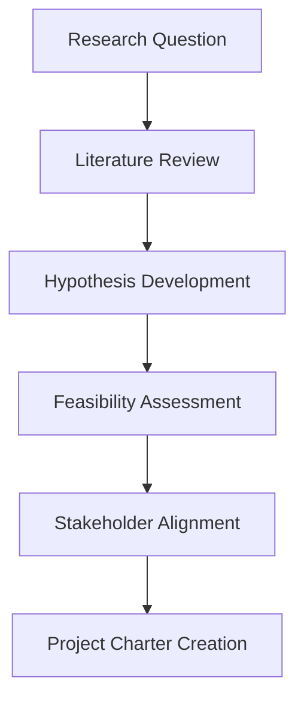
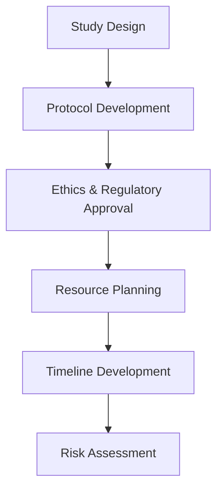
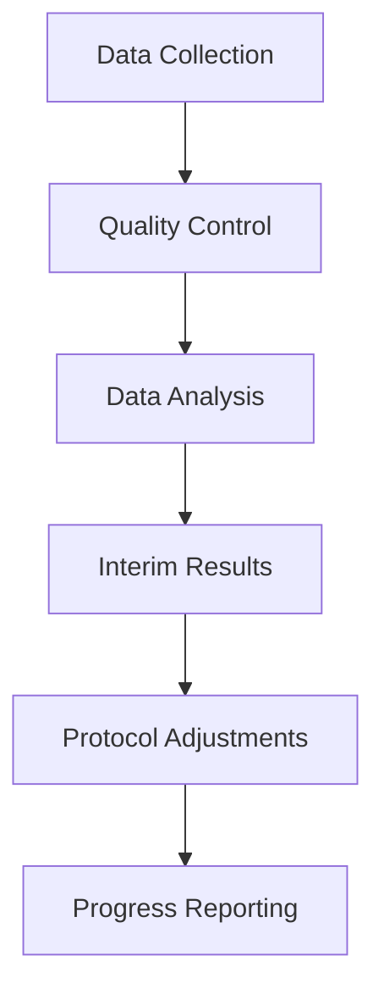
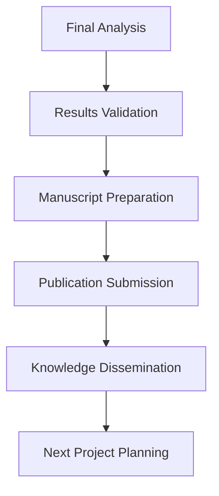

# Project Definition for Scholar Persona

## Overview

For the Scholar persona in the OpenBioCure platform, a "project" represents the fundamental unit of research work - a structured, goal-oriented endeavor that advances medical knowledge and contributes to the scientific community. Projects are the Scholar's primary mechanism for discovery, collaboration, and career advancement.

## What Constitutes a Project

### Core Definition
A **research project** is a systematic investigation with defined objectives, methodologies, timelines, and expected outcomes. It represents a Scholar's commitment to advancing knowledge in their field through rigorous scientific inquiry.

### Project Characteristics
- **Time-Bound**: Typically spans 6 months to 5+ years
- **Goal-Oriented**: Has specific research questions and hypotheses
- **Methodologically Rigorous**: Follows established scientific protocols
- **Collaborative**: Often involves multiple researchers and institutions
- **Funded**: Usually supported by grants or institutional resources
- **Measurable**: Has defined success metrics and deliverables

## Project Types in Scholar Context

### 1. Discovery Research Projects
- **Purpose**: Uncover new scientific insights and mechanisms
- **Timeline**: 2-5 years
- **Output**: Novel findings, publications, potential breakthroughs
- **Example**: Investigating new drug targets for cancer treatment

### 2. Clinical Trial Projects
- **Purpose**: Evaluate treatments in human populations
- **Timeline**: 1-7 years
- **Output**: Clinical evidence, safety data, efficacy results
- **Example**: Phase II clinical trial for a new immunotherapy

### 3. Translational Research Projects
- **Purpose**: Bridge basic science and clinical applications
- **Timeline**: 3-6 years
- **Output**: Clinical protocols, treatment guidelines
- **Example**: Converting laboratory discoveries into patient therapies

### 4. Collaborative Network Projects
- **Purpose**: Multi-institutional research initiatives
- **Timeline**: 5-10 years
- **Output**: Large-scale datasets, consortium findings
- **Example**: International genomics consortium studies

### 5. Grant-Funded Projects
- **Purpose**: Specific research objectives tied to funding
- **Timeline**: 1-3 years
- **Output**: Funded research, publications, progress reports
- **Example**: NIH R01 research project

## Project Lifecycle for Scholars

### Phase 1: Project Conception

### Phase 2: Project Planning

### Phase 3: Project Execution

### Phase 4: Project Completion

## Project Management Elements

### Planning Components
- **Research Protocol**: Detailed methodology and procedures
- **Timeline**: Milestones and deliverables schedule
- **Budget**: Resource allocation and cost management
- **Team Structure**: Roles, responsibilities, and collaboration model
- **Risk Management**: Contingency planning and mitigation strategies

### Execution Components
- **Data Management**: Collection, storage, and quality control
- **Progress Tracking**: Regular updates and milestone monitoring
- **Communication**: Team coordination and stakeholder updates
- **Quality Assurance**: Standards compliance and validation
- **Documentation**: Research logs and process records

### Completion Components
- **Results Analysis**: Statistical analysis and interpretation
- **Publication**: Manuscript preparation and submission
- **Knowledge Transfer**: Findings dissemination and education
- **Archive Management**: Data and documentation preservation
- **Impact Assessment**: Long-term outcomes and influence

## Project Success Metrics

### Research Output Metrics
- **Publications**: Number and quality of peer-reviewed papers
- **Presentations**: Conference presentations and invited talks
- **Patents**: Intellectual property and commercialization potential
- **Citations**: Academic impact and influence on field

### Collaboration Metrics
- **Partnerships**: Cross-institutional and interdisciplinary collaboration
- **Team Growth**: Research team expansion and skill development
- **Network Expansion**: Professional connections and reputation building
- **Knowledge Sharing**: Contribution to scientific community

### Impact Metrics
- **Clinical Translation**: Influence on patient care and treatment
- **Policy Influence**: Impact on healthcare guidelines and regulations
- **Industry Collaboration**: Partnerships with pharmaceutical and biotech companies
- **Public Health**: Contribution to population health outcomes

## Project Integration with Platform Features

### Research Dashboard Integration
- **Project Overview**: Centralized project information and status
- **Timeline Management**: Visual project progress and milestone tracking
- **Resource Allocation**: Budget, personnel, and equipment management
- **Risk Monitoring**: Issue identification and resolution tracking

### Collaboration Tools
- **Team Workspaces**: Shared project environments and communication
- **Document Management**: Protocol, data, and manuscript organization
- **Peer Review System**: Internal feedback and quality assurance
- **Knowledge Repository**: Research findings and methodology storage

### Data Management
- **Data Integration**: Multiple source combination and analysis
- **Quality Control**: Automated validation and error detection
- **Statistical Analysis**: Built-in analytical tools and visualization
- **Compliance**: Regulatory and ethical requirement adherence

## Project Challenges and Solutions

### Common Challenges
1. **Timeline Delays**: Research complexity and unexpected findings
2. **Resource Constraints**: Limited funding and personnel availability
3. **Regulatory Hurdles**: Ethics approval and compliance requirements
4. **Data Quality Issues**: Inconsistent or incomplete datasets
5. **Collaboration Coordination**: Multi-site and multi-disciplinary coordination

### Platform Solutions
1. **Automated Workflows**: Streamlined processes and approval systems
2. **Resource Optimization**: Efficient allocation and utilization tracking
3. **Compliance Management**: Built-in regulatory and ethical frameworks
4. **Quality Assurance**: Automated validation and error detection
5. **Collaboration Tools**: Integrated communication and coordination platforms

## Future Project Trends

### Emerging Project Types
- **AI-Enhanced Research**: Machine learning and artificial intelligence integration
- **Digital Health Projects**: Mobile health and telemedicine research
- **Precision Medicine**: Personalized treatment and prevention approaches
- **Real-World Evidence**: Large-scale observational and pragmatic studies

### Platform Adaptations
- **Automated Analysis**: AI-powered data processing and pattern recognition
- **Virtual Collaboration**: Enhanced remote and distributed research capabilities
- **Blockchain Security**: Secure data sharing and intellectual property protection
- **IoT Integration**: Real-time data collection from connected medical devices

## Conclusion

For the Scholar persona, projects represent the essence of their professional identity and contribution to medical science. The OpenBioCure platform must support the complete project lifecycle, from initial conception through final dissemination, while enabling collaboration, ensuring quality, and maximizing impact. Understanding the Scholar's project needs is fundamental to creating a platform that truly serves the research community.

## Related Documentation

- [Scholar Persona](./scholar.md) - Complete Scholar persona definition
- [Research Dashboard](../research-dashboard.md) - Project management features
- [Workspace Collaboration](../workspace-collaboration.md) - Team collaboration tools
- [AI Assistant](../ai-assistant.md) - Research support and automation
