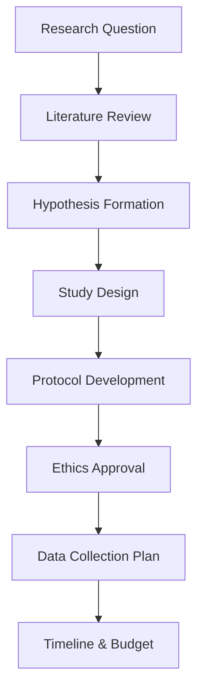
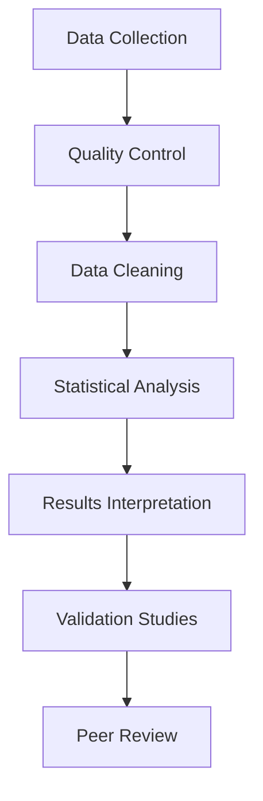
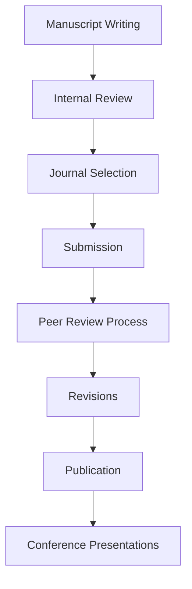
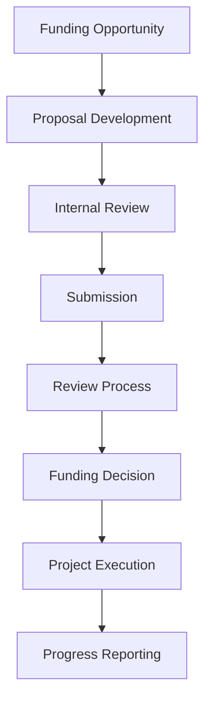

# Scholar Persona

## Overview
The Scholar is a primary persona in the OpenBioCure platform - a dedicated researcher, academic, or medical professional who conducts in-depth research, publishes findings, and contributes to the advancement of medical knowledge and treatments.

## Characteristics

### Demographics
- **Role**: Research Scientist, Medical Researcher, Academic Professor, Clinical Investigator
- **Experience**: 5-20+ years in research and academia
- **Education**: PhD, MD/PhD, or equivalent advanced degree
- **Age Range**: 30-65 years old
- **Work Environment**: Universities, Research Institutions, Hospitals, Pharmaceutical Companies

### Personality Traits
- **Analytical**: Deep analytical thinking and attention to detail
- **Curious**: Naturally inquisitive and driven by discovery
- **Patient**: Willing to invest time in thorough research
- **Collaborative**: Values peer review and scientific collaboration
- **Ethical**: Committed to research integrity and patient safety

### Technical Skills
- **Research Methods**: Advanced statistical analysis, experimental design
- **Data Analysis**: Bioinformatics, clinical data interpretation
- **Writing**: Scientific writing, grant proposals, peer-reviewed publications
- **Tools**: Familiar with research databases, analysis software, lab equipment

## Goals & Motivations

### Primary Goals
1. **Discover New Knowledge**: Uncover novel insights in medical research
2. **Publish Research**: Share findings through peer-reviewed journals
3. **Secure Funding**: Obtain grants and research support
4. **Advance Career**: Build reputation in the scientific community
5. **Improve Patient Care**: Translate research into clinical applications

### Pain Points
1. **Data Access**: Difficulty accessing comprehensive, high-quality datasets
2. **Collaboration**: Limited opportunities for cross-institutional collaboration
3. **Time Management**: Balancing research, teaching, and administrative duties
4. **Funding**: Competitive grant environment and limited resources
5. **Data Integration**: Combining data from multiple sources and formats

## Workflows

### 1. Research Planning & Design

### 2. Data Collection & Analysis

### 3. Publication & Dissemination

### 4. Grant & Funding Cycle

## Platform Usage Patterns

### Daily Activities
- **Morning**: Review new research alerts, check collaboration requests
- **Midday**: Data analysis, literature review, writing
- **Afternoon**: Team meetings, peer reviews, grant writing
- **Evening**: Reading latest publications, planning next day

### Weekly Activities
- **Monday**: Research planning, team coordination
- **Tuesday-Thursday**: Data analysis, writing, experiments
- **Friday**: Progress review, collaboration outreach
- **Weekend**: Literature review, grant preparation

### Monthly Activities
- **Week 1**: Progress assessment, milestone review
- **Week 2**: Collaboration development, networking
- **Week 3**: Data analysis, manuscript preparation
- **Week 4**: Grant submissions, conference planning

## Key Platform Features for Scholars

### Research Tools
- **Data Explorer**: Advanced querying and visualization
- **Literature Hub**: Comprehensive research database
- **Collaboration Network**: Find and connect with peers
- **Grant Database**: Funding opportunities and requirements

### Workflow Support
- **Project Management**: Research timeline and milestone tracking
- **Data Integration**: Combine multiple data sources
- **Statistical Analysis**: Built-in analysis tools
- **Publication Support**: Manuscript preparation and submission

### Collaboration Features
- **Team Workspaces**: Shared research environments
- **Peer Review System**: Internal review and feedback
- **Knowledge Sharing**: Research findings and insights
- **Networking**: Professional connections and mentorship

## Success Metrics

### Research Output
- Number of publications per year
- Impact factor of journals
- Citations and h-index
- Conference presentations

### Collaboration
- Cross-institutional partnerships
- Interdisciplinary research projects
- International collaborations
- Industry partnerships

### Funding
- Grant success rate
- Total funding secured
- Diversity of funding sources
- Return on investment

## Integration with Other Personas

### With Clinicians
- Translational research projects
- Clinical trial design
- Patient outcome studies
- Evidence-based practice

### With Industry Partners
- Drug development research
- Technology transfer
- Commercialization pathways
- Regulatory compliance

### With Patients
- Patient-centered research
- Real-world evidence
- Patient-reported outcomes
- Community engagement

## Future Trends & Adaptations

### Emerging Technologies
- **AI/ML Integration**: Automated data analysis and pattern recognition
- **Blockchain**: Secure data sharing and intellectual property protection
- **Virtual Reality**: Immersive data visualization and collaboration
- **IoT Integration**: Real-time data collection from medical devices

### Evolving Research Methods
- **Precision Medicine**: Personalized treatment approaches
- **Digital Health**: Mobile health and telemedicine research
- **Real-World Evidence**: Large-scale observational studies
- **Open Science**: Collaborative, transparent research practices
