# 📁 Workspace Microservice Epic - Central RAG Orchestrator

## Overview
The Workspace Microservice serves as the **central RAG (Retrieval-Augmented Generation) orchestrator** and **intelligent heart** of the OpenBioCure platform. It provides **private-only document management** with AI-powered research assistance, while coordinating data from all platform services to deliver unified research insights. 

**Key Principle**: Workspace documents remain **always private** to the uploader unless explicitly added to a Project, which is the **only collaborative surface**. The workspace acts as the scholar's personal research environment that can intelligently combine:
1. **Personal library** (private vectors)
2. **Project materials** (shared vectors via project inclusion)
3. **Analytics signals** (trend data from analytics-service)
4. **AI insights** (summaries, hypotheses from ai-service)

## Epic Goals
- **Central RAG Orchestration**: Manage multiple vector stores (private, shared, global) for intelligent research assistance
- **Service Aggregation**: Coordinate calls to project-service, analytics-service, and ai-service for unified insights
- **Intelligent Query Routing**: Route queries to appropriate vector stores based on scope and permissions
- **Document Management**: Enable secure document upload and storage with full privacy control
- **Research Dashboard**: Provide comprehensive research insights by aggregating cross-service data
- **Natural Language Interface**: Enable scholars to ask questions and get answers with citations across all their research

## Core Architecture

### Platform-Wide Orchestration


### RAG Orchestrator Flow


### Service Integration Architecture


## Workspace Service Internal Architecture

### Service Components & Data Flow


### Detailed Component Responsibilities

#### **Frontend Layer**
- **Scholar Dashboard UI**: Main research interface with integrated search and document management (`ScholarDashboard.tsx`)
- **Search Interface**: Natural language query input with scope selection
- **Document Upload UI**: Multi-format file upload with progress tracking
- **Scope Tabs**: Visual navigation between Workspace, Project, and Global query scopes

#### **API Layer**
- **Query API**: `/api/workspace/query` - Natural language query processing
- **Document API**: `/api/workspace/documents` - Document CRUD operations
- **Dashboard API**: `/api/workspace/dashboard` - Cross-service data aggregation
- **Integration API**: `/api/workspace/projects/:id/*` - Proxy to other services

#### **Core Orchestration Layer**
- **RAG Orchestrator**: Central coordinator for retrieval-augmented generation
- **Query Router**: Routes queries to appropriate vector stores and services
- **Scope Resolver**: Determines access permissions and query scope
- **Permission Manager**: Enforces ACL at vector store and service level
- **Service Coordinator**: Manages cross-service data aggregation

#### **Processing Layer**
- **Document Processor**: Handles multi-format document ingestion
- **Vector Embedder**: Generates semantic embeddings for documents
- **Text Extractor**: Extracts text content from various file formats
- **Metadata Extractor**: Extracts document metadata and entities
- **LLM Synthesizer**: Generates coherent answers from retrieved context
- **Re-Ranker**: Improves retrieval relevance using advanced ranking

#### **Data Access Layer**
- **Vector Store Manager**: Manages CRUD operations across vector stores
- **Document Repository**: Database operations for document metadata
- **Permission Repository**: Database operations for access control
- **Query Repository**: Database operations for query history and saved searches
- **Service Integration Layer**: HTTP clients for external service communication

#### **Storage Layer**
- **Private Vector Store (ws:userId)**: User-specific document vectors (embeddings only)
- **Project Vector Store (proj:projectId)**: Project-shared document vectors (embeddings only)
- **Global Vector Store (global:tenant)**: Tenant-wide public research vectors (embeddings only)
- **PostgreSQL Database**: Document metadata, permissions, and relational data
- **MinIO File Storage**: **Original document files** (PDF, DOC, etc.) with bucket isolation
- **Elasticsearch Index**: Full-text search and vector similarity search (references MinIO files)

#### **Infrastructure Layer**
- **Event Bus (Kafka)**: Asynchronous event processing and service communication
- **Cache Layer (Redis)**: Query result caching and session management
- **Monitoring & Metrics**: Performance tracking and health monitoring
- **Audit Logger**: Comprehensive audit trail for compliance and security

## Core Concepts

### Vector Store Hierarchy
1. **Private Vector Store (`ws:userId`)**: User's private documents and research
2. **Project Vector Store (`proj:projectId`)**: Shared project documents and collaborative research
3. **Global Vector Store (`global:tenant`)**: Public research, published papers, and global knowledge base
4. **Metadata Database**: Access control lists (ACL), user preferences, and query routing rules

### Document Privacy & Project Collaboration Model

```mermaid
graph TD
    A[Document Upload] --> B[Private Vector Store<br/>ws:userId<br/>🔒 Always Private]
    B --> C{Scholar Adds to Project?}
    C -->|No| D[Remains Private Only<br/>Personal RAG Queries]
    C -->|Yes| E[Project Service Integration]
    E --> F[Document Added to<br/>Project Vector Store<br/>proj:projectId]
    F --> G[Team RAG Queries<br/>🤝 Collaborative Access]
    G --> H[Project Dashboard<br/>Phase-Aware Insights]
    
    D --> I[Workspace UI<br/>🔍 Private Research]
    H --> J[Project UI<br/>🔍 Team Research]
    
    style B fill:#ff9999
    style F fill:#99ccff
    style I fill:#ffcc99
    style J fill:#ccffcc
```


### Query Scope Resolution with Cross-Service Orchestration

```mermaid
graph TD
    A[User Query] --> B["UI Scope Tabs<br/>Workspace • Project • Global"]
    B --> C[Scope Router & Query Planner]
    
    C --> D[📁 Workspace Scope<br/>Private Documents Only]
    C --> E[🤝 Project Scope<br/>Project Documents + Analytics]
    C --> F[🌍 Global Scope<br/>Public Research + Trends]
    C --> G[🔄 Multi-Scope<br/>Cross-Service Orchestration]
    
    D --> H[Private Vector Store<br/>ws:userId]
    E --> I[Project Vector Store<br/>proj:projectId]
    E --> J[Analytics Service<br/>Project Trends]
    F --> K[Global Vector Store<br/>global:tenant]
    F --> L[AI Service<br/>Global Insights]
    G --> M[All Available Sources<br/>Based on Permissions]
    
    H --> N[Personal Research Results]
    I --> O[Collaborative Results]
    J --> O
    K --> P[Global Knowledge Results]
    L --> P
    M --> Q[Unified Cross-Service Results]
    
    N --> R[Retrieve & Re-rank]
    O --> R
    P --> R
    Q --> R
    
    R --> S[LLM Synthesis + Cross-Service Data]
    S --> T[Answer + Citations + Analytics + Inline Actions]
    T --> U[Add to Project Button<br/>Save Search<br/>Share Insight]
```


## User Stories

### 🤖 RAG & AI-Powered Research

#### US-WS-001: Cross-Service Query Orchestration
**As a** Scholar  
**I want** to ask questions that combine my private documents, project data, and platform insights  
**So that** I get comprehensive research answers from my entire research ecosystem  

**Acceptance Criteria:**
- **Private Workspace Queries**: Search personal documents only (ws:userId vector store)
- **Project Queries**: Search project documents + analytics data from projects I'm part of  
- **Global Queries**: Search public research + trending topics + AI insights
- **Multi-Scope Queries**: Intelligently combine all accessible sources based on permissions
- **Cross-Service Integration**: Include analytics signals, AI summaries, and project status in answers
- **UI Scope Tabs**: Clear visual indication of query scope (Workspace | Project | Global)

**Definition of Done:**
- Query orchestration routes to correct services based on scope selection
- Cross-service data combination maintains source attribution  
- Workspace queries respect strict privacy (never leak to projects)
- Project queries include relevant analytics and collaboration context
- Global queries surface platform-wide trends and insights
- Scope tabs provide clear visual feedback of query boundaries

---

#### US-WS-002: Project Phase-Aware AI Optimization
**As a** Scholar  
**I want** AI assistance optimized for my current research phase  
**So that** I get contextually relevant help throughout my research journey  

**Acceptance Criteria:**
- **Discovery Phase**: Auto-cluster documents, surface research gaps, suggest related work
- **Planning Phase**: Retrieve relevant protocols, past methodologies, sample size calculations  
- **Execution Phase**: Auto-extract tables/figures, track data collection progress
- **Analysis Phase**: Synthesize findings into draft story, identify key insights
- **Publication Phase**: Generate abstracts, format citations, suggest target journals
- **Phase Context**: Use project service data to understand current research phase

**Definition of Done:**
- AI assistance adapts based on project phase from project-service
- Discovery phase identifies gaps in literature coverage >80% accuracy
- Planning phase suggests relevant methodologies from similar projects
- Execution phase extracts structured data from documents >90% accuracy  
- Analysis phase generates coherent research narratives
- Publication phase produces publication-ready content

---

#### US-WS-003: Natural Language Research Queries with Inline Actions
**As a** Scholar  
**I want** to ask research questions in natural language  
**So that** I can get intelligent answers from my documents and research  

**Acceptance Criteria:**
- Support natural language queries ("What are the latest treatments for cancer?")
- Route queries to appropriate vector stores based on selected scope tab
- Return answers with citations and source documents
- **Inline Actions**: "Add to Project" button directly from search results
- **UI Context**: Clear scope indication (Workspace | Project | Global tabs)
- Support follow-up questions with conversation context
- Handle complex multi-part research questions
- Provide confidence scores for answers

**Definition of Done:**
- Query processing completes in <5 seconds for simple queries
- Answer accuracy >85% based on available documents
- Citation accuracy >95% with correct source attribution
- Conversation context maintained for 10+ exchanges
- Support for queries across 100,000+ documents
- Multi-language query support

---

#### US-WS-004: Intelligent Scope Routing
**As a** System  
**I want** to automatically route queries to the right vector stores  
**So that** users get relevant results while respecting permissions  

**Acceptance Criteria:**
- Automatically detect query scope (personal, project, global)
- Route to appropriate vector stores based on user permissions
- Combine results from multiple stores when appropriate
- Apply ACL filtering at retrieval time
- Handle cross-project queries with proper permission checks
- Optimize query performance based on scope

**Definition of Done:**
- Scope detection accuracy >90% for various query types
- Permission checks complete in <100ms
- Cross-store queries maintain security boundaries
- Query routing optimizes for performance and relevance
- ACL filtering prevents unauthorized data access
- Audit logging for all scope routing decisions

---

#### US-WS-005: Advanced Document Retrieval
**As a** Scholar  
**I want** the system to find the most relevant documents for my queries  
**So that** I get high-quality, contextual answers  

**Acceptance Criteria:**
- Semantic search across all accessible vector stores
- Re-ranking based on relevance, recency, and user behavior
- Support for complex queries with multiple concepts
- Document similarity matching and clustering
- Integration with document metadata for enhanced retrieval
- Personalized retrieval based on user research interests

**Definition of Done:**
- Retrieval precision >80% for research queries
- Re-ranking improves relevance by >20% over base retrieval
- Complex queries return comprehensive results
- Similarity matching identifies related documents accurately
- Metadata integration improves retrieval quality
- Personalization adapts based on user interaction patterns

---

### 📄 Document Management & Vector Store Integration

#### US-WS-005-A: Document Version Management
**As a** Scholar  
**I want** to upload multiple versions of my research documents  
**So that** I can track document evolution and reference specific versions in my research  

**Acceptance Criteria:**
- **Version Upload**: Upload new versions of existing documents without losing previous versions
- **Version Tracking**: Each version gets unique MinIO path and vector store entry
- **Latest Version Identification**: System automatically identifies and surfaces the latest version
- **Version History**: Access complete version history with upload dates and change descriptions
- **Version-Specific Queries**: RAG queries can target specific document versions when needed
- **Rollback Capability**: Ability to set any previous version as the current "latest" version

**Definition of Done:**
- Version upload creates new MinIO file with incremented path (file-v1.pdf → file-v2.pdf)
- Each version generates separate vector embeddings for optimal search accuracy
- PostgreSQL tracks version hierarchy and latest version pointers
- UI displays version history with clear visual indicators
- RAG queries default to latest version but can access specific versions
- Version rollback updates latest version pointer and project shared content

---

#### US-WS-006: Secure Private Document Upload with Versioning & Vector Processing
**As a** Scholar  
**I want** to upload documents that are automatically processed for AI queries  
**So that** I can ask questions about my research materials  

**Acceptance Criteria:**
- Support multiple file formats (PDF, DOC, DOCX, TXT, HTML, XML, CSV, JSON)
- **Document Storage**: Original files stored in MinIO with user-specific bucket isolation
- **Vector Processing**: Text extraction and chunking for vector embedding generation
- **Strict Privacy**: Document files and vectors remain in private user namespace
- **Metadata Extraction**: Title, author, date, entities stored in PostgreSQL
- **No Auto-Sharing**: Documents remain private unless explicitly added to projects
- Background processing with progress indicators and file validation

**Definition of Done:**
- All core formats process correctly with >95% text extraction accuracy
- **MinIO Storage**: Files stored with versioned paths (e.g., `ws-{userId}/documents/file-v1.pdf`)
- **Vector Generation**: Embeddings created and stored in private vector store within 5 minutes for 100MB files
- Document chunks optimized for retrieval (500-1000 tokens each)
- **PostgreSQL Metadata**: Links document records to versioned MinIO paths and vector store IDs
- **Version Management**: Document versions tracked with automatic latest version identification
- **File Security**: MinIO access policies prevent cross-user file access across all versions
- Error handling and retry mechanisms for failed processing

---

#### US-WS-007: Project-Based Document Sharing & Vector Updates
**As a** Scholar  
**I want** my documents to be searchable by project collaborators when shared  
**So that** the team can ask questions across all project materials  

**Acceptance Criteria:**
- **Project Service Integration**: Documents shared only through explicit project addition
- **Version-Aware Sharing**: Project members access latest version by default, with option to access specific versions
- **File Reference Sharing**: MinIO file access granted to project members for all document versions
- **Vector Store Copying**: Latest document version vectors copied to project vector store (proj:projectId)
- **Source Remains Private**: All document versions stay in private MinIO bucket (ws:userId)
- **Project Access**: Project members get read access to all shared document versions via access policies
- **Version Synchronization**: Project vector store updates when new versions are uploaded
- Permission-based access control for project queries and file downloads
- Automatic vector store updates when project membership changes
- Document removal from project store when removed from project
- **Project-Only Collaboration**: No direct workspace-to-workspace sharing

**Definition of Done:**
- Project vector store updates complete within 2 minutes of sharing
- Permission changes propagate to vector stores within 5 minutes
- Sharing revocation immediately removes query access
- Cross-project queries respect permission boundaries
- Version control maintains vector store consistency
- Audit logging for all vector store permission changes

---

### 🔍 Research Dashboard & Service Aggregation

#### US-WS-008: Unified Research Dashboard with Cross-Service Orchestration
**As a** Scholar  
**I want** a comprehensive dashboard showing all my research activities  
**So that** I can manage my research workflow efficiently  

**Acceptance Criteria:**
- **Cross-Service Orchestration**: Aggregate data from project-service, analytics-service, and ai-service
- **Personal Workspace View**: Private documents, personal research progress, saved queries
- **Project Integration View**: Active projects with real-time status from project-service
- **Analytics Integration**: Research trends, usage patterns from analytics-service  
- **AI Insights Integration**: Summaries, hypotheses, gap analysis from ai-service
- **Phase-Aware Content**: Tailor dashboard content based on current project phases
- **Quick Actions**: Easy "Add to Project" from dashboard, save searches, share insights

**Definition of Done:**
- Dashboard loads all aggregated data in <3 seconds
- Real-time updates for project status and notifications
- Service integration maintains data consistency
- Performance remains fast with 100+ projects and 10,000+ documents
- Error handling for service unavailability
- Responsive design for mobile and desktop access

---

#### US-WS-009: Advanced Cross-Service Query Orchestration
**As a** Scholar  
**I want** to ask questions that span my documents, projects, and analytics  
**So that** I can get comprehensive insights across my research ecosystem  

**Acceptance Criteria:**
- Route queries to appropriate services based on content
- Combine results from workspace documents and project data
- Include analytics insights in query responses
- Provide unified citations across all data sources
- Handle queries about research trends and patterns
- Support complex multi-service queries

**Definition of Done:**
- Cross-service queries complete in <10 seconds
- Result combination maintains source attribution
- Analytics integration provides relevant metrics
- Multi-service citations are properly formatted
- Complex queries return comprehensive, coherent answers
- Service failure gracefully degrades functionality

---

### 🔐 Permission Management & Security

#### US-WS-010: Vector Store Access Control with Workspace Privacy
**As a** System  
**I want** to enforce granular access control at the vector store level  
**So that** private research remains secure while enabling collaboration  

**Acceptance Criteria:**
- **Strict Workspace Privacy**: User-specific private vector stores (ws:userId) with complete isolation
- **Project-Only Collaboration**: Project-based vector stores (proj:projectId) with role-based access
- **Global Knowledge Access**: Global vector store (global:tenant) with tenant-level permissions
- **No Workspace Cross-Access**: Zero ability for users to access each other's workspace documents
- **Project Service Integration**: All sharing happens through project service, not direct workspace access
- ACL enforcement at query time, not just document level
- Real-time permission updates across all vector stores
- Audit logging for all vector store access attempts

**Definition of Done:**
- Zero cross-user data leakage in private stores
- Project permissions correctly filter vector search results
- Global store respects tenant boundaries
- Permission checks add <50ms to query latency
- Real-time updates complete within 5 minutes
- Comprehensive audit trail for security compliance

---

#### US-WS-011: Query Privacy & Data Protection
**As a** Scholar  
**I want** my queries and research patterns to remain private  
**So that** my research direction and interests are protected  

**Acceptance Criteria:**
- Query logs stored with user-specific encryption
- No cross-tenant query data sharing
- Anonymous analytics that don't reveal user behavior
- Option to disable query logging for sensitive research
- Secure deletion of query history upon request
- Compliance with GDPR and research data protection

**Definition of Done:**
- Query encryption prevents unauthorized access
- Cross-tenant isolation verified by security audit
- Analytics aggregation maintains user anonymity
- Query logging can be disabled per user preference
- Secure deletion meets regulatory requirements
- Privacy compliance verified by legal review

---

## API Endpoints

### Core RAG & Query Operations
```http
POST   /api/workspace/query                  # Ask natural language question
GET    /api/workspace/queries                # Get query history
POST   /api/workspace/queries/save           # Save query for reuse
DELETE /api/workspace/queries/:id            # Delete saved query
GET    /api/workspace/conversations/:id      # Get conversation history
POST   /api/workspace/conversations          # Start new conversation
```

### Document Management & Vector Processing
```http
POST   /api/workspace/documents              # Upload document → MinIO + vector processing
POST   /api/workspace/documents/:id/versions # Upload new version of existing document
GET    /api/workspace/documents              # List user documents (latest versions by default)
GET    /api/workspace/documents/:id          # Get document details (metadata + MinIO download URL for latest)
GET    /api/workspace/documents/:id/versions # Get all versions of document
GET    /api/workspace/documents/:id/versions/:version # Get specific version details
GET    /api/workspace/documents/:id/download # Download latest version from MinIO
GET    /api/workspace/documents/:id/versions/:version/download # Download specific version
PUT    /api/workspace/documents/:id          # Update document metadata (affects latest version)
DELETE /api/workspace/documents/:id          # Delete document (all versions: MinIO files + vectors + metadata)
DELETE /api/workspace/documents/:id/versions/:version # Delete specific version
POST   /api/workspace/documents/:id/reprocess # Reprocess latest version vectors
POST   /api/workspace/documents/:id/versions/:version/reprocess # Reprocess specific version
```

### Research Dashboard & Aggregation
```http
GET    /api/workspace/dashboard              # Get unified research dashboard
GET    /api/workspace/projects               # Get user projects (from project-service)
GET    /api/workspace/insights               # Get AI insights aggregated across services
GET    /api/workspace/trends                 # Get research trends (from analytics-service)
GET    /api/workspace/analytics/:projectId   # Get project analytics
GET    /api/workspace/recommendations        # Get personalized research recommendations
```

### Vector Store Management
```http
GET    /api/workspace/vectors/stats          # Get vector store statistics
POST   /api/workspace/vectors/reindex        # Trigger vector store reindexing
GET    /api/workspace/vectors/health         # Check vector store health
DELETE /api/workspace/vectors/:storeId       # Clear specific vector store
```

### Service Integration Endpoints
```http
GET    /api/workspace/projects/:id/details   # Get project details (proxy to project-service)
POST   /api/workspace/projects/:id/documents # Add document to project (coordinate services)
GET    /api/workspace/ai/analysis/:docId     # Get AI analysis (proxy to ai-service)
GET    /api/workspace/analytics/usage       # Get usage analytics (proxy to analytics-service)
```

### Permission & Scope Management
```http
GET    /api/workspace/permissions/scopes     # Get available query scopes
PUT    /api/workspace/permissions/default    # Set default query scope
GET    /api/workspace/acl/:resourceId        # Get access control list
PUT    /api/workspace/acl/:resourceId        # Update access control list
```

### Workspace Service Technology Stack

#### **Core Technologies**
- **Framework**: FastAPI (Python 3.11+)
- **Database**: PostgreSQL 15+ (metadata, permissions, queries)
- **Vector Database**: Elasticsearch 8+ with dense vector support
- **File Storage**: MinIO (S3-compatible object storage) - **Primary document storage**
- **Cache**: Redis 7+ (query caching, session management)
- **Message Queue**: Apache Kafka (event streaming)

#### **AI/ML Technologies**
- **Embeddings**: sentence-transformers, OpenAI embeddings
- **LLM Integration**: OpenAI GPT-4, Anthropic Claude
- **Text Processing**: spaCy, NLTK for entity extraction
- **Vector Search**: FAISS, Elasticsearch k-NN

#### **External Integrations**
- **Document Processing**: Apache Tika (multi-format support)
- **OCR**: Tesseract for image text extraction
- **Citation Management**: CrossRef API, PubMed API
- **File Format Support**: PyPDF2, python-docx, Beautiful Soup

#### **Infrastructure & DevOps**
- **Containerization**: Docker + Docker Compose
- **Orchestration**: Kubernetes (production)
- **Monitoring**: Prometheus + Grafana
- **Logging**: ELK Stack (Elasticsearch, Logstash, Kibana)
- **Security**: HashiCorp Vault (secrets management)

### Repository Pattern Implementation

#### **Repository Structure**
```python
# BaseRepository from shared components
from backend.shared.repositories.base_repository import BaseRepository

class DocumentRepository(BaseRepository[Document]):
    def __init__(self, db: Session):
        super().__init__(db, Document)
    
    def get_by_user_id(self, user_id: str) -> List[Document]:
        return self.get_all_by_field("uploader_id", user_id)
    
    def get_by_project_id(self, project_id: str) -> List[Document]:
        return self.db.query(Document).join(DocumentPermission).filter(
            DocumentPermission.project_id == project_id
        ).all()

class QueryRepository(BaseRepository[Query]):
    def __init__(self, db: Session):
        super().__init__(db, Query)
    
    def get_conversation_queries(self, conversation_id: str) -> List[Query]:
        return self.get_all_by_field("conversation_id", conversation_id)

class VectorStoreRepository:
    def __init__(self, elasticsearch_client):
        self.es = elasticsearch_client
    
    def index_document_vectors(self, store_id: str, vectors: List[DocumentVector]):
        # Implementation for vector indexing
        pass
    
    def search_vectors(self, store_id: str, query_vector: List[float], limit: int = 10):
        # Implementation for vector similarity search
        pass
```

#### **Service Layer Pattern**
```python
class WorkspaceService:
    def __init__(self, 
                 document_repo: DocumentRepository,
                 query_repo: QueryRepository,
                 vector_store_repo: VectorStoreRepository,
                 permission_service: PermissionService,
                 event_producer: EventProducer):
        self.document_repo = document_repo
        self.query_repo = query_repo
        self.vector_store_repo = vector_store_repo
        self.permission_service = permission_service
        self.event_producer = event_producer
    
    async def process_query(self, user_id: str, query: str, scope: str) -> QueryResult:
        # RAG orchestration logic
        pass
    
    async def upload_document(self, user_id: str, file: UploadFile) -> Document:
        # Document processing and vector generation
        pass

class CrossServiceOrchestrator:
    def __init__(self,
                 project_service_client: ProjectServiceClient,
                 analytics_service_client: AnalyticsServiceClient,
                 ai_service_client: AIServiceClient):
        self.project_client = project_service_client
        self.analytics_client = analytics_service_client
        self.ai_client = ai_service_client
    
    async def get_dashboard_data(self, user_id: str) -> DashboardData:
        # Aggregate data from all services
        pass
```

## Data Models

### Query & Conversation
```typescript
interface Query {
  id: string;
  userId: string;
  tenantId: string;
  query: string;
  scope: 'private' | 'project' | 'global' | 'multi';
  scopeIds?: string[]; // project IDs for project scope
  
  // Results
  answer: string;
  citations: Citation[];
  confidence: number;
  
  // Processing
  vectorStoresQueried: string[];
  retrievalTime: number;
  synthesisTime: number;
  
  // Context
  conversationId?: string;
  followUpTo?: string;
  
  // Audit
  createdAt: Date;
  language: string;
}

interface Conversation {
  id: string;
  userId: string;
  title: string;
  queries: Query[];
  context: ConversationContext;
  createdAt: Date;
  updatedAt: Date;
}

interface Citation {
  documentId: string;
  documentTitle: string;
  chunkId: string;
  content: string;
  relevanceScore: number;
  sourceType: 'private' | 'project' | 'global';
  projectId?: string;
}
```

### Vector Store Management
```typescript
interface VectorStore {
  id: string;
  type: 'private' | 'project' | 'global';
  namespace: string; // userId, projectId, or tenantId
  documentCount: number;
  vectorCount: number;
  lastUpdated: Date;
  health: 'healthy' | 'degraded' | 'unhealthy';
}

interface DocumentVector {
  id: string;
  documentId: string;
  chunkId: string;
  content: string;
  embedding: number[];
  metadata: VectorMetadata;
  storeId: string;
  createdAt: Date;
}

interface VectorMetadata {
  title?: string;
  author?: string;
  projectId?: string;
  tags: string[];
  entities: string[];
  chunkIndex: number;
  wordCount: number;
}
```

### Service Integration
```typescript
interface DashboardData {
  projects: ProjectSummary[];
  recentDocuments: Document[];
  aiInsights: AIInsight[];
  trends: ResearchTrend[];
  analytics: AnalyticsSummary;
  notifications: Notification[];
}

interface ProjectSummary {
  id: string;
  title: string;
  status: string;
  collaborators: number;
  documentsCount: number;
  lastActivity: Date;
  progress: number;
}

interface AIInsight {
  id: string;
  type: 'pattern' | 'gap' | 'trend' | 'recommendation';
  title: string;
  description: string;
  confidence: number;
  sources: Citation[];
  createdAt: Date;
}
```

## Performance Requirements

### Query Performance
- Simple queries: <5 seconds end-to-end
- Complex multi-scope queries: <10 seconds
- Vector retrieval: <2 seconds for 100,000+ documents
- Re-ranking: <1 second for top 100 results
- LLM synthesis: <3 seconds for comprehensive answers

### Document Processing
- Text extraction: <2 minutes for 100MB files
- Vector embedding: <5 minutes for full document processing
- Vector store updates: <2 minutes for document addition
- Bulk document processing: 1000+ documents per hour

### Service Integration
- Dashboard aggregation: <3 seconds for complete dashboard
- Cross-service queries: <10 seconds for multi-service responses
- Real-time updates: <5 minutes for permission changes
- Service health checks: <1 second response time

## Security Requirements

### Vector Store Security
- User isolation: Complete separation of private vector stores
- Project boundaries: Project vector stores respect membership
- Global access: Tenant-level isolation for global stores
- Query-time filtering: ACL enforcement at retrieval level

### Data Protection
- Vector encryption: AES-256 for vector embeddings
- Query encryption: End-to-end encryption for sensitive queries
- Audit logging: Comprehensive logging for compliance
- Data retention: Configurable retention policies per tenant

### AI Security
- Model isolation: Tenant-specific model fine-tuning if needed
- Prompt injection protection: Input sanitization and validation
- Output filtering: Content filtering for inappropriate responses
- Rate limiting: Query rate limits per user and tenant

## Success Metrics

### Research Efficiency
- 50% reduction in time to find relevant research
- 70% increase in cross-document insights discovery
- 60% improvement in research question answering accuracy
- 40% increase in research collaboration through shared queries

### System Performance
- 99.9% uptime for query processing
- <5 second average query response time
- >85% user satisfaction with answer quality
- >90% citation accuracy for provided sources

### User Adoption
- 80% of scholars use natural language queries weekly
- 60% of projects have shared document queries
- 50% of users save and reuse complex queries
- 90% of uploaded documents are successfully processed for queries

## Definition of Epic Done

### Core Functionality
- RAG orchestrator processes queries across all vector stores
- Document upload and vector processing pipeline complete
- Cross-service data aggregation functional
- Permission-based query routing working
- Natural language interface provides accurate answers with citations

### Integration Complete
- All service integrations (project, analytics, AI, auth) functional
- Vector store management and health monitoring active
- Real-time permission updates across all stores
- Dashboard aggregation provides unified research view

### Security & Compliance
- Vector store isolation verified by security audit
- Query privacy and data protection implemented
- Compliance requirements (GDPR, HIPAA) met
- Comprehensive audit logging functional

### Performance & Quality
- All performance targets met in load testing
- Answer quality meets accuracy requirements
- System handles expected user and document volumes
- Error handling and graceful degradation working

---

## Frontend Integration Architecture

### ScholarDashboard.tsx as Workspace Interface

The current `ScholarDashboard.tsx` component serves as the **primary workspace interface** - the scholar's central research hub. It needs to be enhanced to include document upload capabilities and integrate with the workspace service for unified data aggregation.

#### **Current Implementation Analysis**
```typescript
// Current ScholarDashboard.tsx structure
const ScholarDashboard: React.FC = () => {
  usePageTracking('scholar_dashboard');
  const { trackEvent, trackAction } = useEventTracking();
  
  return (
    <AppLayout>
      {isLoading ? (
        <ScholarDashboardSkeleton />
      ) : (
        <ScholarHomeDashboard /> // Current home dashboard component
      )}
    </AppLayout>
  );
};
```

#### **Enhanced Workspace Interface Architecture**
```mermaid
graph TD
    A[ScholarDashboard.tsx<br/>Workspace Interface] --> B[Workspace Service API<br/>/api/workspace/dashboard]
    
    A --> C[Document Upload Section]
    A --> D[Natural Language Search Bar]
    A --> E[Scope Tabs: Workspace | Project | Global]
    A --> F[Projects Overview]
    A --> G[AI Insights Panel]
    A --> H[Research Trends]
    A --> I[Recent Documents]
    A --> J[Quick Actions]
    
    B --> K[Cross-Service Orchestration]
    K --> L[Project Service<br/>User Projects]
    K --> M[Analytics Service<br/>Research Trends]
    K --> N[AI Service<br/>Insights & Analysis]
    
    C --> O[/api/workspace/documents<br/>Upload & Processing]
    D --> P[/api/workspace/query<br/>RAG Processing]
    F --> Q[Navigate to Project-Specific UI]
```

### **Frontend Data Flow: Workspace vs Project Services**

#### **ScholarDashboard.tsx → Workspace Service (Central Hub)**
```typescript
interface DashboardData {
  // Personal workspace data
  documents: Document[];
  recentQueries: Query[];
  savedSearches: SavedSearch[];
  
  // Cross-service aggregated data
  projects: ProjectSummary[];        // FROM project-service
  aiInsights: AIInsight[];          // FROM ai-service  
  trends: ResearchTrend[];          // FROM analytics-service
  notifications: Notification[];    // FROM multiple services
  
  // Quick stats
  documentCount: number;
  activeProjectsCount: number;
  weeklyQueryCount: number;
}

// Enhanced ScholarDashboard component
const ScholarDashboard: React.FC = () => {
  const [dashboardData, setDashboardData] = useState<DashboardData | null>(null);
  const [uploadProgress, setUploadProgress] = useState<number>(0);
  const [searchScope, setSearchScope] = useState<'workspace' | 'project' | 'global'>('workspace');
  
  // Fetch unified dashboard data from workspace service
  useEffect(() => {
    fetchDashboardData();
  }, []);
  
  const fetchDashboardData = async () => {
    const response = await fetch('/api/workspace/dashboard', {
      headers: { 'Authorization': `Bearer ${token}` }
    });
    const data = await response.json();
    setDashboardData(data);
  };
  
  const handleDocumentUpload = async (files: FileList, existingDocumentId?: string) => {
    const formData = new FormData();
    Array.from(files).forEach(file => formData.append('files', file));
    
    // Add version description if this is an update
    if (existingDocumentId) {
      const description = prompt('Describe the changes in this version:');
      formData.append('changeDescription', description || '');
    }
    
    // Upload to workspace service which handles:
    // 1. Store file in private MinIO bucket with versioned path (ws-{userId}/documents/file-v2.pdf)
    // 2. Extract text and generate vectors for new version
    // 3. Store versioned metadata in PostgreSQL
    // 4. Index vectors in private vector store
    // 5. Update latest version pointer
    const endpoint = existingDocumentId 
      ? `/api/workspace/documents/${existingDocumentId}/versions`
      : '/api/workspace/documents';
      
    const response = await fetch(endpoint, {
      method: 'POST',
      body: formData,
      headers: { 'Authorization': `Bearer ${token}` }
    });
    
    const result = await response.json();
    // result contains: document metadata, MinIO path, version number, processing status
    
    // Refresh dashboard after upload
    await fetchDashboardData();
  };
  
  const handleNaturalLanguageQuery = async (query: string) => {
    const response = await fetch('/api/workspace/query', {
      method: 'POST',
      headers: { 'Content-Type': 'application/json', 'Authorization': `Bearer ${token}` },
      body: JSON.stringify({ query, scope: searchScope })
    });
    
    const result = await response.json();
    // Display RAG response with citations and inline actions
    return result;
  };
  
  const navigateToProject = (projectId: string) => {
    // Navigate to project-specific UI that calls project-service directly
    router.push(`/projects/${projectId}`);
  };
  
  return (
    <AppLayout>
      <WorkspaceInterface
        dashboardData={dashboardData}
        onDocumentUpload={handleDocumentUpload}
        onSearch={handleNaturalLanguageQuery}
        onProjectClick={navigateToProject}
        searchScope={searchScope}
        onScopeChange={setSearchScope}
        uploadProgress={uploadProgress}
      />
    </AppLayout>
  );
};
```

### **Service Responsibility Matrix**

| **UI Component** | **Data Source** | **Service Called** | **Purpose** |
|------------------|-----------------|-------------------|-------------|
| `ScholarDashboard.tsx` | Unified dashboard data | **Workspace Service** | Personal research hub & orchestration |
| Projects overview panel | Project summaries | Workspace Service → Project Service | Show user's active projects |
| Document upload | File processing | **Workspace Service** | Private document management |
| Natural language search | RAG queries | **Workspace Service** | Intelligent research assistance |
| AI insights panel | AI analysis | Workspace Service → AI Service | Research recommendations |
| Trends panel | Analytics data | Workspace Service → Analytics Service | Research patterns |
| Project detail page | Detailed project data | **Project Service** (direct) | Project-specific operations |

### **Navigation & User Flow**

#### **Workspace-Centric Flow**
1. **User lands on ScholarDashboard.tsx** → **Workspace Interface**
2. **Upload documents** → **Workspace Service** (private by default)
3. **Ask questions** → **Workspace Service RAG** (across personal + project + global scopes)
4. **View project summaries** → **Workspace Service** (aggregated from Project Service)
5. **Click specific project** → **Navigate to Project UI** → **Project Service** (direct calls)

#### **Project-Specific Flow**
1. **User clicks project from dashboard** → **Navigate to `/projects/{id}`**
2. **Project UI calls Project Service directly** for detailed operations
3. **Project collaboration features** managed by Project Service
4. **Document sharing** → Project Service coordinates with Workspace Service

### **Frontend Component Structure**

```
frontend/src/components/
├── scholar/
│   ├── ScholarDashboard.tsx          # Main workspace interface (enhanced)
│   ├── ScholarHomeDashboard.tsx      # Current home dashboard (to be integrated)
│   └── workspace/                    # New workspace-specific components
│       ├── DocumentUploadPanel.tsx
│       ├── NaturalLanguageSearch.tsx
│       ├── ScopeTabs.tsx
│       ├── ProjectsOverview.tsx
│       ├── AIInsightsPanel.tsx
│       └── ResearchTrends.tsx
├── projects/                         # Project-specific components
│   ├── ProjectDashboard.tsx          # Detailed project interface
│   ├── ProjectCollaboration.tsx     # Team features
│   └── ProjectDocuments.tsx         # Project document management
└── shared/
    ├── SearchInterface.tsx           # Reusable search component
    └── DocumentViewer.tsx           # Document display component
```

### **API Integration Patterns**

#### **Workspace Service Integration (ScholarDashboard.tsx)**
```typescript
// Workspace-centric API calls
const workspaceAPI = {
  getDashboard: () => fetch('/api/workspace/dashboard'),
  uploadDocument: (file: File) => fetch('/api/workspace/documents', { method: 'POST', body: formData }),
  queryRAG: (query: string, scope: string) => fetch('/api/workspace/query', { method: 'POST', body: { query, scope }}),
  getProjects: () => fetch('/api/workspace/projects'), // Proxies to project-service
  getInsights: () => fetch('/api/workspace/insights'), // Proxies to ai-service
  getTrends: () => fetch('/api/workspace/trends'),     // Proxies to analytics-service
};
```

#### **Project Service Integration (Project Components)**
```typescript
// Project-specific API calls (direct to project-service)
const projectAPI = {
  getProjectDetails: (id: string) => fetch(`/api/projects/${id}`),
  updateProject: (id: string, data: any) => fetch(`/api/projects/${id}`, { method: 'PUT', body: data }),
  manageCollaborators: (id: string, users: string[]) => fetch(`/api/projects/${id}/collaborators`, { method: 'POST', body: users }),
  getProjectDocuments: (id: string) => fetch(`/api/projects/${id}/documents`),
};
```

### **Key Implementation Decisions**

1. **ScholarDashboard.tsx = Workspace Interface**: The current `ScholarDashboard.tsx` represents the scholar's personal workspace and should call the **workspace service** for unified data aggregation.

2. **Projects Overview Data Source**: The projects displayed in `ScholarDashboard.tsx` come from **workspace service**, which aggregates project summaries from the **project service**.

3. **Document Upload Location**: Document upload happens in the **workspace interface** and goes to **workspace service** for private MinIO storage, metadata persistence, and vector processing.

4. **Service Orchestration**: **Workspace service** acts as the orchestrator, calling other services (project, analytics, AI) to provide unified dashboard data.

5. **Navigation Pattern**: **Workspace → Project** navigation moves from workspace-orchestrated overview to project-specific detailed management.

This architecture ensures that the workspace service serves as the intelligent heart of the platform while maintaining clear separation of concerns between personal research management and collaborative project work.

---

This workspace microservice serves as the intelligent heart of the OpenBioCure platform, providing scholars with AI-powered research assistance while maintaining strict security and privacy controls across all their research activities.
