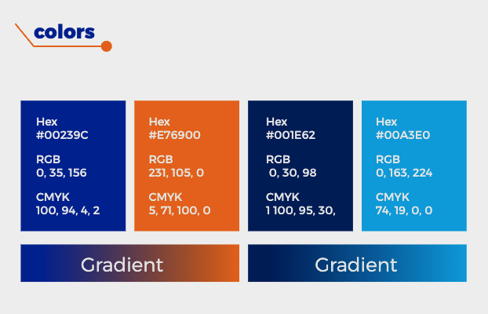

# Visual Identity – OPENBIOCURE

## Introduction
Deliver an open-source, AI-powered research platform that enables healthcare professionals, academic researchers, and institutional stakeholders to ingest, analyze, and act on vast volumes of domain-specific literature and structured data.  

The goal is to democratize access to cutting-edge insights, accelerating evidence-based decision-making, standardizing best practices, and reducing time-to-innovation across clinical, pharmaceutical, and public-health settings.

---

## Forming the Logo
- Laboratory bottle  
- Robot  
- Data analysis  

---

## Fonts
**Montserrat**  

## Colors
- **Blue (Primary)**  
  - CMYK: 100, 94, 4, 2  
  - RGB: 0, 35, 156  
  - HEX: `#00239C`  

- **Dark Blue**  
  - CMYK: 100, 95, 30, 1  
  - RGB: 0, 30, 98  
  - HEX: `#001E62`  

- **Orange**  
  - CMYK: 5, 71, 100, 0  
  - RGB: 231, 105, 0  
  - HEX: `#E76900`  

- **Cyan**  
  - CMYK: 74, 19, 0, 0  
  - RGB: 0, 163, 224  
  - HEX: `#00A3E0`  

## Gradients

---

## Logo
- Gradient versions  
- Final logo  
- Logo applications on colors  
- All logo options  

### Dimensions
- 8x : 2x : x  
- 3x : 8x : x  

### Wrong Uses
- Miscolored versions  
- Distorted ratios  
- Inverted logos  

---

## Patterns and Photo Style
- Approved brand patterns  
- Photography style references  

---

## Icons
- Set of approved icons for usage

## Background Colors for pages

- Use the following rgb(249 250 251 / var(--tw-bg-opacity, 1));

